## 第2章 Simpledger功能模块介绍
### 2.1 区块结构介绍
区块结构分为两部分，即区块头和区块体。区块头就是simpledger中的区块链部分。它保存了前一个区块（也可称为父区块）的哈希值，通过区块头的连接形成了一条由密码学背书的链。区块体包含了此区块中记录的一系列交易，以及对应的共识信息

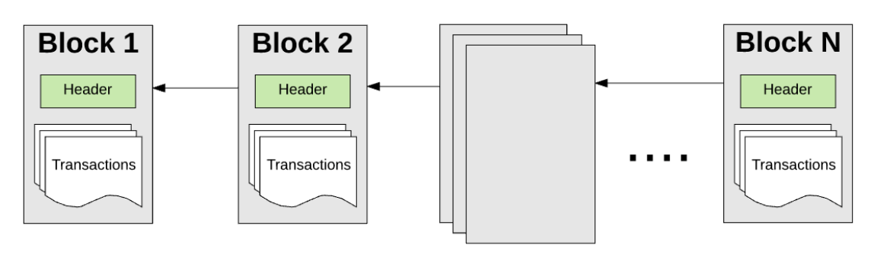

#### 2.1.1 区块头

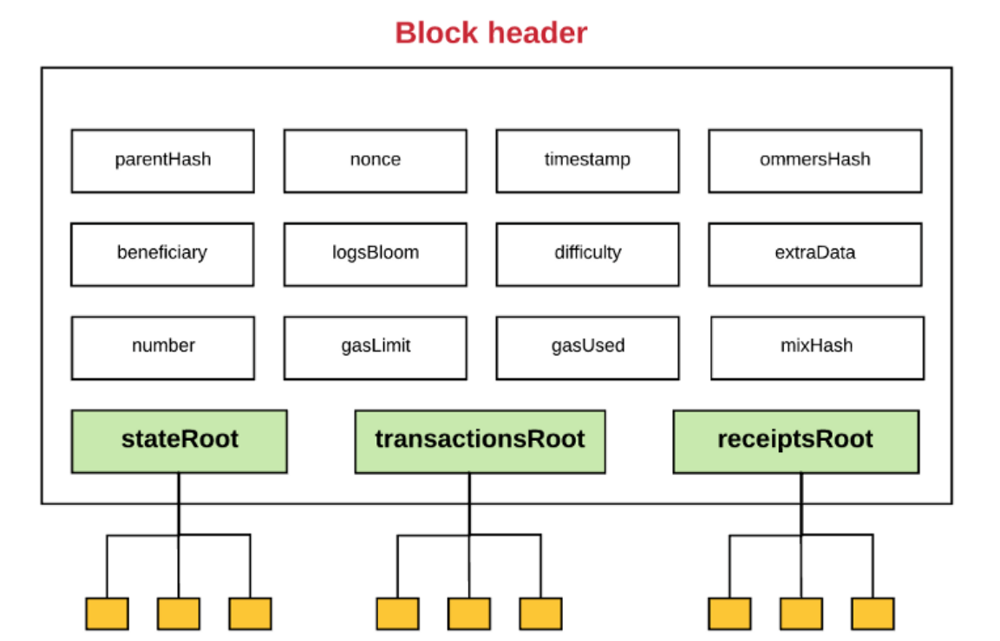

- stateRoot：世界状态树的根节点哈希值（在所有交易被执行后）。
- transactionsRoot：交易树的根哈希值。是区块中所有交易信息的摘要。
- receiptsRoot：每当交易执行时，都会生成对应结果的交易收据。此处就是这个交易收据列表的树根节点哈希。
  其中状态树是Merkle Patricia Tree，交易、回执树是Red Black Tree.

三棵树求取根哈希，可以得到区块头中的StateRoot,TransactionsRoot,ReceiptsRoot三个字段。这样就建立了交易和区块头字段的映射。当其他用户收到块，根据块里的交易可以计算出收据和状态，计算三个根哈希后和区块头的三个字段进行验证，判断这是否为合法的块。

#### 2.1.2 区块体

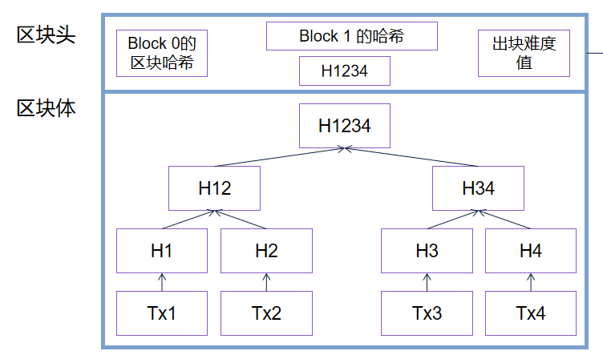

区块体内以MPT的形式，存储着区块内的全部交易信息，并最终产生transactionsRoot。每个区块能容纳多少笔交易与每笔交易的gas、区块的gaslimt、以及共识是否超时有关。

### 2.2 网络模块
由于高性能联盟链的TPS最高可达**20000**+TPS，区块链网络模块的负载增加，因此需要设计**新的拓扑**网络消息传输结构来进行消息的传递。在PBFT共识中，节点的角色分为**观察节点**与**共识节点**，观察节点与共识节点将根据不同的消息进行不同地网络拓扑，以在尽可能地降低共识节点网络载和保持网络健壮性之间找到平衡点。

#### 2.2.1 节点分类
在**Simpledger**网络中，节点有三中角色： 负责出块的**共识节点**，负责同步消息的**观察节点**,没有任何权限访问网络的**游离节点**。**Simpledger**通过智能合约和共识来区分、管理节点角色。

#### 2.2.2 节点加入网络

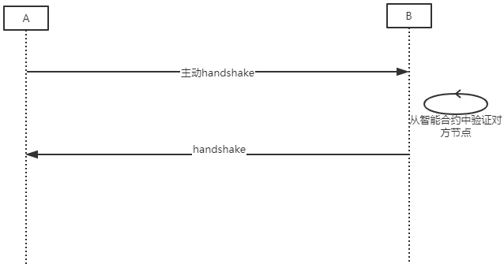

如上图所示，当节点A主动加入节点B的网络中时，需要经历以下步骤：
```text

1： 节点A主动向节点B发起握手请求

2： 节点B在节点准入的智能合约中查询节点A的信息，如对方不在智能合约中拥有合法身份，则拒绝建立连接；反之，与节点A建立连接。

3：通过智能合约和共识，获得对方节点在网络中的index以统一的构建网络拓扑。

```

实际上在以上的步骤中，每个节点都会主动地将合约中的所有节点加入dailTask，主动地与对方建立连接已保证网络的完整性。而当游离节点主动请求加入合法网络时，则无法通过智能合约的认证机制，保证了网络安全性。

#### 2.2.3 交易同步方式
由于**Simpledger**在PBFT共识下的TPS可达20000+，因此需要对交易广播方式进行限制。由之前的每个节点全量广播交易变为按照树拓扑结构广播，使得总网络复杂度**O(n^2)**降低为**O(n)**。且由于在PBFT共识中，只有共识节点负责出块，所以交易消息将不会转发给观察节点，进一步降低网络负载。其网络拓扑如下：


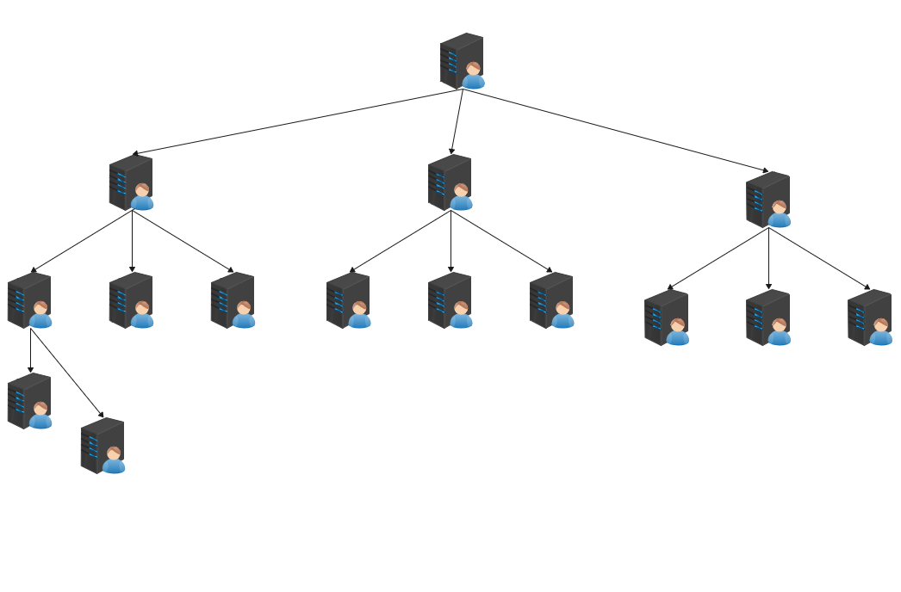


**共识节点**： 接收交易的**第一个共识节点**会将自身在整个共识节点网络中的index标记在交易里，并以自身的index为根构造网络拓扑，选择自身的index的子节点进行交易转发(附带了自身的index，表示树根)，如果所选子节点与自身没有建立网络连接，则将在此视图下接替子子节点的子节点，进行转发，如此反复。而收到了附带index的交易时，**观察节点**选择忽略(理论上不可能会有这个问题，导致此情况发生的情景可能为：将观察节点选举为共识节点，此时观察节点的状态还没有更新，而共识节点已经更新，并将交易转发给它，此情况下也可忽略，因为交易有多层措施来避免失败且是允许失败的)。**共识节点**会以交易附带的index为树根构造相同的网络拓扑，转发给在此视图下的自身的子节点。


**观察节点**： 而接收交易的**第一个观察节点**会随机选择一名共识节点并将该共识节点的index赋值给交易，将此交易转发给该共识节点。如果该共识节点没有与自身建立网络连接，则转发给该节点的子节点。

#### 2.2.3 区块账本同步方式
由于在**PBFT**共识中，节点拥有两种不同的身份: **共识节点**(负责达成共识出块)、**观察节点**(只负责同步区块信息)。且由于区块数据过大，如果按照原有的广播消息模型，观察节点很大的概率会向共识节点fetch最新的区块，最终所有的网络负载都将集中到共识节点上，导致共识节点网络超时，从而影响区块链的性能。

为了使共识节点出新块之后的单节点的网络复杂度从O(n)降低到O(1)。我们设计了一种树状的网络拓扑，和一种改进后的新块头消息体。网络拓扑如图：

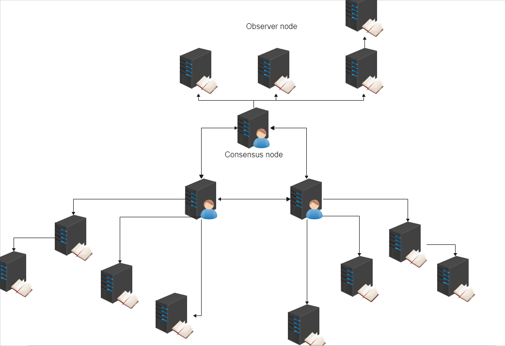

新的块头消息体为

```go
type newBlockHashesData []struct {
Hash    common.Hash
Number  uint64
IsFetch uint8
}
```

由于新的块头消息除了使其他节点向自身fetch最新的区块信息，还可以改变自身在对方视图的状态。所以新的块头消息需要全量广播以更新最新的状态。新增字段**IsFetch**让对方节点感知是否可以向提供状态的节点进行fetch。而**IsFetch**默认为0，即默认只更新状态不进行fetch。只有当对方节点属于网络拓扑中的子节点时，此标记置为1，提示对方可以向自身fetch，从而降低网络负载。

而网络拓扑则是按照如下规则构建：

```text

1： 观察节点平摊给共识节点，如有j个观察节点，i个共识节点，则每个共识节点最多分配⌈j/i⌉个观察节点。

2： 共识节点在发送新的块消息体时，会同时选择共识子节点和观察子节点进行标记。而观察节点在发送新的块头消息时，只选择观察子节点进行标记。

3： 选择策略为：每个节点以自身为树根构造网络拓扑，选择自身的子节点，如子节点无法进行通信，则会接替子节点的任务，如此反复。

```

#### 2.2.4 定时更新状态

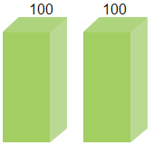
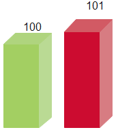

由于在**PBFT**共识中，两个共识节点会根据自身的视图投票。当其中一个节点出新块后，发送给另一个节点的新块消息如果因为网络原因丢失，则双方的视图可能为如图所示(consensus1: me: 100, other: 100; consensus2: me: 101,other: 100)，所以consensus1永远不会更新自身的状态，此时consensus1 会提议出第101个块，而consensus2会提议出102个块，导致共识瘫痪。因此需要增加新的消息体**NewPeerStatusMsg**保证双方状态的完全一致性。:

```go

type newPeerStatusData struct {
TD   uint64
Hash common.Hash
}

```

首先分析一下出现节点状态不一致的根本原因： **最新的新块消息没有发送到另外节点**。由于低状态的节点没有获得到已经是最新状态的节点的状态，即在它是视图中，没有感知到最新的状态。可以通过让旧的节点感知到最新的状态，以此来及时更新自身状态，最后所有节点达成共识。

流程如下：

```txt

1.每隔默认的状态同步时间(30s)， 节点比较对方peer的最新状态和30s之前的旧状态，如果对方peer的最新的状态更新了，则不进行任何操作。否则将自身的当前状态发送给对方。
2.当收到对方的状态消息时，如对方的状态是比当前视图的状态新的，则更新对方在自身视图的状态。如自身的状态比对方的状态新，则代表对方没有接收到自身之前发送的新块头消息，则发送自身的状态消息。
3.最终所有的节点都能获得最新的状态消息，从而更新自身状态。

```


### 2.3 存储模块
#### 2.3.1数据库类型
Leveldb：键值对数据库，Simpledger中共有三个LevelDB数据库，分别是BlockDB、StateDB和ExtrasDB，BlockDB保存了块的主体内容，包括块头和交易；StateDB保存了账户的状态数据；ExtrasDB保存了收据信息和其他辅助信息。

RLP：RLP(Recursive Length Prefix）是一种编码算法，用于编码任意的具有嵌套结构的二进制数据，是simpledger联盟链数据序列化的主要方法。

PRLP: PRLP(Parallel Recursive Length Prefix)是经过优化的可并行化的RLP编码算法。

#### 2.3.2存储整体结构

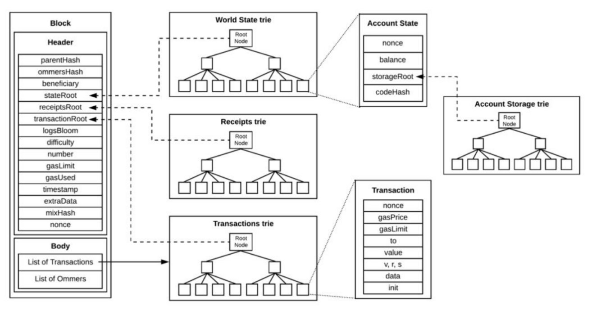

#### 2.3.3 世界状态树

simplechain链中所有的账户信息都体现在世界状态之中，并由世界状态树保存。如果你想知道某一账户的余额，或者某智能合约当前的状态，就需要通过查询世界状态树来获取该账户的具体状态信息。账户分为两种：

- **外部账户(Externally owned account)：**
被私钥控制且没有任何代码与之关联。一个外部账户可以创建交易，来发送消息给另一个外部账户或合约账户，以此来触发转账交易和智能合约的调用、创建。
- **合约账户(Contract account)：**
被它们的合约代码控制且有代码与之关联。合约账户不可以自己发起一个交易，只能被外部账户调用。

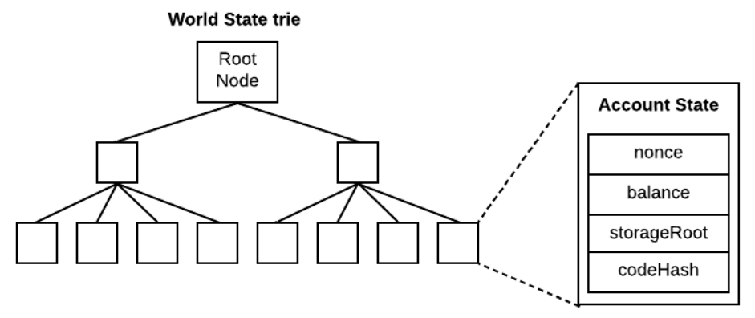

- **nonce：**
从此地址发送出去的交易数量或者此账号产生的合约创建操作。
- **balance：**
此账号所拥有的gas数量。
- **storageRoot：**
账户存储树的根节点哈希值。
- **codeHash：**
对于合约账户，就是此账户存储 EVM 代码的哈希值。对于 EOA 账户此处留空。

#### 2.3.4 账户状态树
账户存储树是保存与账户相关联数据的结构。该项只有合约账户才有，而在 EOA 中，storageRoot 留空、 codeHash 则是一串空字符串的哈希值。所有智能合约的数据都以 32 字节映射的形式保存在账户存储树中。账户状态中的 storageRoot区域负责维持账户存储树根节点哈希值。可以理解为保存Solidity智能合约中的状态变量值。

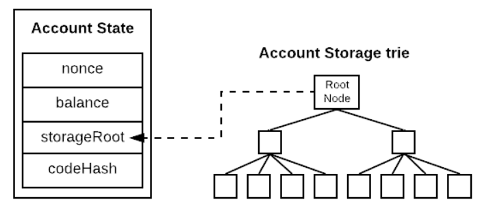

多个区块的MPT树共享了账户状态，子块状态树和父块状态树的差别在于它指向了在子区块中被改变了的账户。这样节省了总的存储空间，方便了块的回滚操作。例如某个智能合约账户中，智能合约的变量值由29改变成了45。

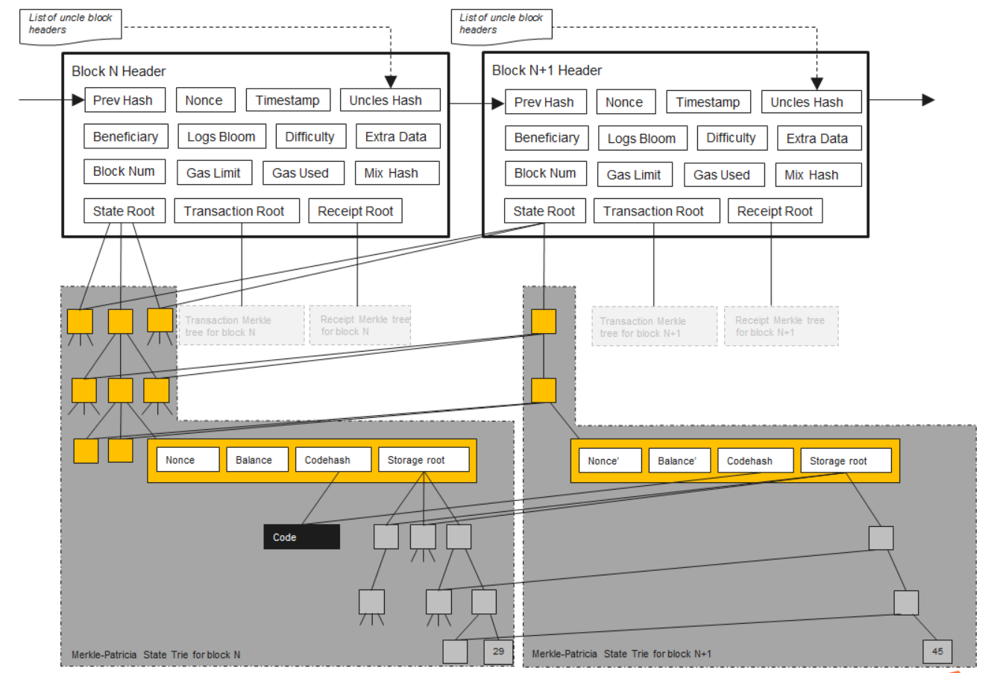

#### 2.3.5 总结

### 2.4 交易模块
#### 2.4.1 交易数据结构
外部账户可以创建交易,用自己的私钥进行签名之发送消息给另一个外部账户或合约账户。两个外部账户之间传送的消息即为转账操作。从外部账户到合约账户的消息会激活合约账户的代码，执行各种操作，也就是我们常说的调用智能合约。可以通过向0地址发起交易来创建合约账户。交易包含以下主要字段：

字段 | 说明
---|---
Type | 交易的类型，ContractCreation（创建合约）还是MessageCall（调用合约或转账）
FromAddress | 发送交易的账户地址
ReceiveAddress | 接受方地址
Value | 向目标账户发送的金额
Data | 交易的附加数据
GasPrice | 为交易付出的Gas价格
Gas | 为交易付出的Gas
Nonce | 发送地址的随机数
Blocklimit | 交易过期的区块高度
VRS | 交易签名结构体

#### 2.4.2 收据数据结构
账户创建交易并向其它节点广播后，会被其它节点执行并放入准备打包的区块。在这个过程中会生成一个收据。收据的主要字段有：

字段 | 说明
---|---
blockHash | 交易所在块的哈希值
blockNumber | 交易在块的序号
status | 交易执行结果
transactionHash | 交易的哈希值
transactionIndex | 交易在块中的序号
from | 发送者地址
to | 接受者地址，为空时候表示创建合约
cumulativeGasUsed | 执行完此交易时候，块内消耗的总的gas值
gasUsed | 本交易所消耗的gas
contractAddress | 当此交易为创建合约时，表示所创建合约的地址，否则为空
logs | 此交易的日志

##### 交易执行结果说明
状态码 | 说明 
---|---
0x1 | 执行成功
0x0 | 未知内部错误
0x2 | 签名验证失败
0x3 | nonce不合法
0x4 | 余额不足
0x5 | 余额不足以支付Gas
0x6 | Gas超出限制
0x7 | 合约部署Gas超出限制
0x8 | Gas超出区块限制
0x9 | 合约日志数量超出限制 
0xa | 合约递归深度超出限制
0xb | 合约地址冲突 
0xc | 合约无法被解析

#### 2.4.3 交易流程
交易——区块链系统的核心，负责记录区块链上发生的一切。区块链引入智能合约后，交易便超出价值转移的原始定义，其更加精准的定义应该是区块链中一次事务的数字记录。无论大小事务，都需要交易的参与。

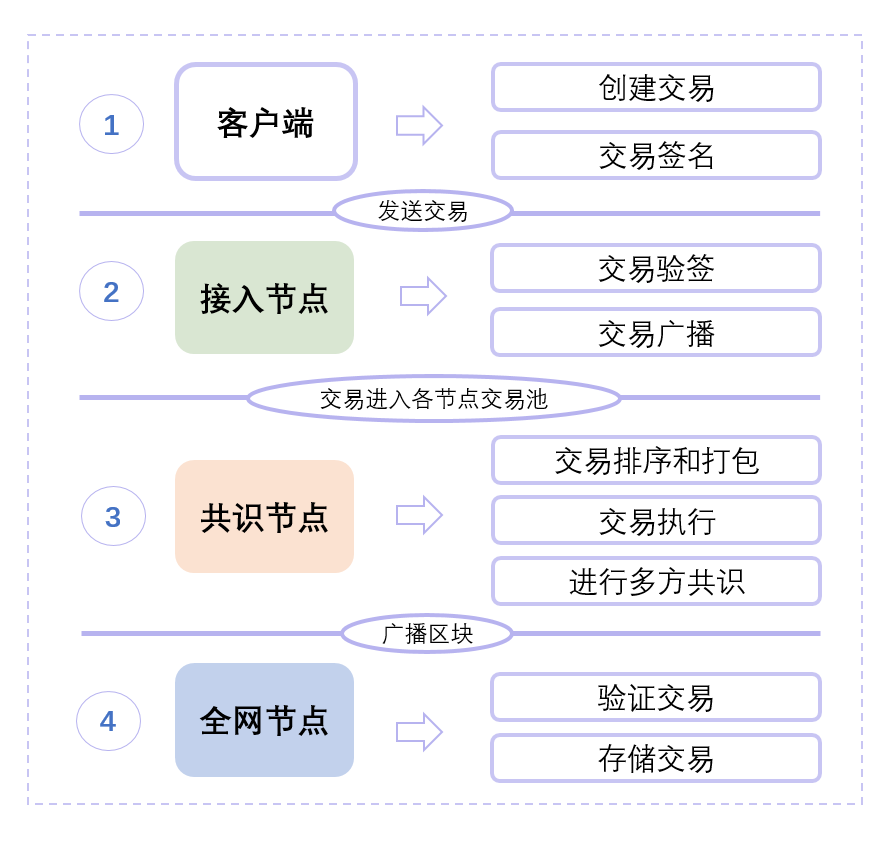

##### 交易发起
用户的请求给到客户端后，客户端会构建出一笔有效交易，交易中包括以下关键信息：
- 发送地址：即用户自己的账户，用于表明交易来自何处。
- 接收地址：交易分为三类，一类是部署合约的交易，一类是调用合约的交易。一类是转账交易，前者，由于交易并没有特定的接收对象，因此规定这类交易的接收地址固定为0x0；后者，则需要将交易的接收地址置为链上合约的地址。
- 交易相关的数据：一笔交易往往需要一些用户提供的输入来执行用户期望的操作，这些输入会以二进制的形式被编码到交易中。
- 交易签名：为了表明交易确实是由自己发送，用户会向SDK提供私钥来让客户端对交易进行签名，其中私钥和用户账户是一一对应的关系。

之后，区块链客户端会再向交易填充一些必要的字段，如用于防交易重放的交易nonce及blockLimit。交易构造完成后，客户端随后便通过RPC信道将交易发送给节点。

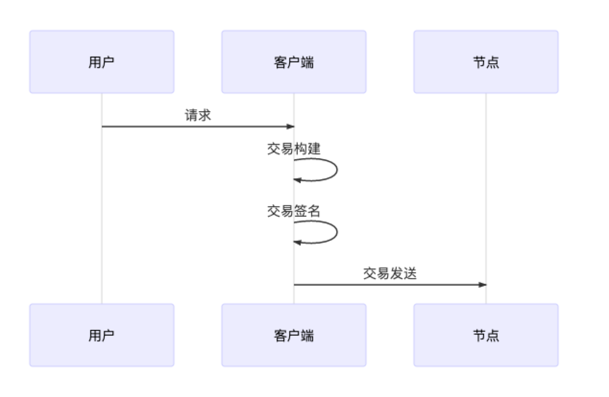

##### 交易池
区块链交易被发送到节点后，节点会通过验证交易签名的方式来验证一笔交易是否合法。若一笔交易合法，则节点会进一步检查该交易是否重复出现过，若从未出现过，则将交易加入交易池缓存起来。若交易不合法或交易重复出现，则将直接丢弃交易。

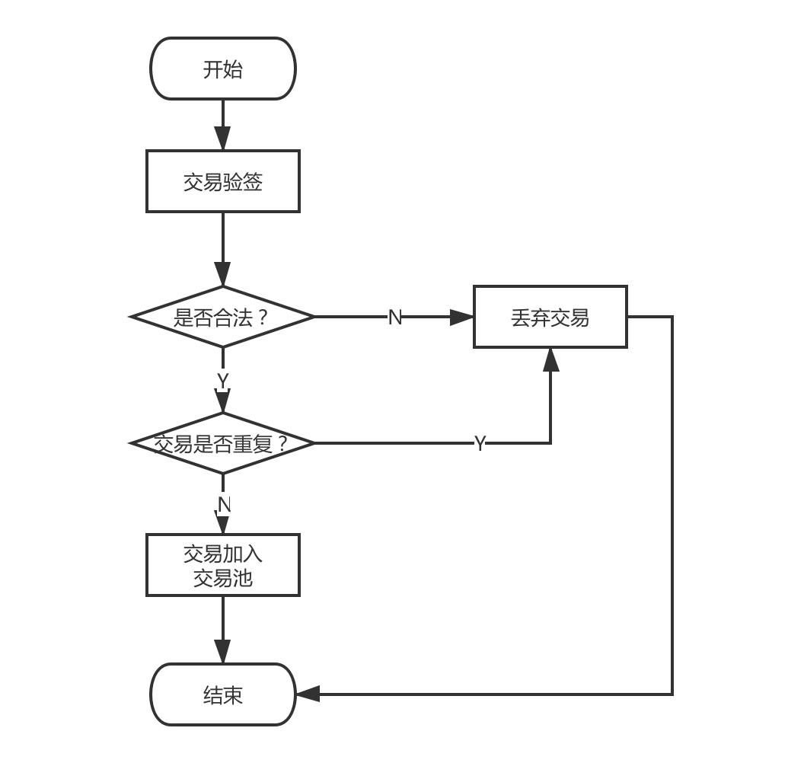


#### 交易验证

目前区块链采用的交易防双花机制主要有两种，UTXO与账户Nonce，但是对于以高性能为目标的联盟区块链来说，UTXO与账户Nonce模型都会在各种方面牺牲性能。
以比特币为首的UTXO机制，每笔交易都需要被记录input交易与output交易，由此一来，每笔交易的字节数将增加，大大增加了交易签名与验签的负担，而对于区块链交易池而言，交易验签是耗时最大的步骤之一。此外，UTXO虽然支持并行交易，但是由于无法保存复杂的合约状态，因此在执行合约交易时，无法通过UTXO直接记录状态执行，因此UTXO模型无法支持合约交易的并行执行；
以以太坊为首的账户Nonce模型，每笔交易在签名时都需要附带账户的nonce序列数，无论交易在验证还是执行的过程中，每个账户的交易都需要依赖账户nonce的顺序进行验证转发与执行，大大降低了交易同步与执行的效率；
因此，在Simplechain高性能联盟链中，采用了交易过期与哈希碰撞技术解决交易双花问题，步骤如下：

① 对于一笔交易Tx1，用户在签名时需要附带交易的过期高度ExpiredNum=N，表示此交易将在区块高度为N时过期

② 当交易Tx1进入交易池后，首先会与交易哈希池的哈希缓存进行对比，未发生碰撞冲突，则经验证后将交易缓存入交易内存池，将交易哈希缓存入交易hash池

③ 当目前区块高度<N，双花的Tx1交易再次被提交时，交易哈希hash1与交易哈希池缓存的hash1冲突，交易Tx1被认为是双花交易舍弃

④ 当目前区块高度>=N，双花的Tx1交易再次被提交时，交易过期高度ExpiredNum<=N，交易过期，交易Tx1被舍弃。
区块链系统由于需要存储所有历史交易数据，从所有区块中检索交易是非常困难并且耗时的，因此本技术采用了交易过期机制，仅缓存一定区块高度内的交易哈希，通过哈希冲突来解决交易双花问题。

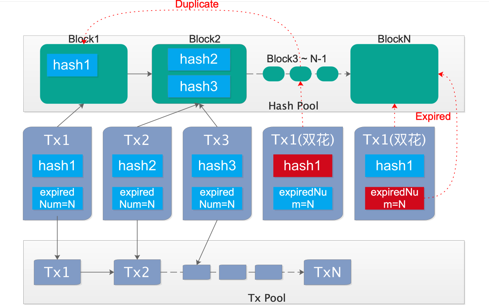

通过这种交易验证机制，交易在交易池中可以被并行验证，大幅提升交易签名以及合法性验证的性能。同时，在交易验证过程中，可以在多线程中预执行交易，提升交易DAG生成效率

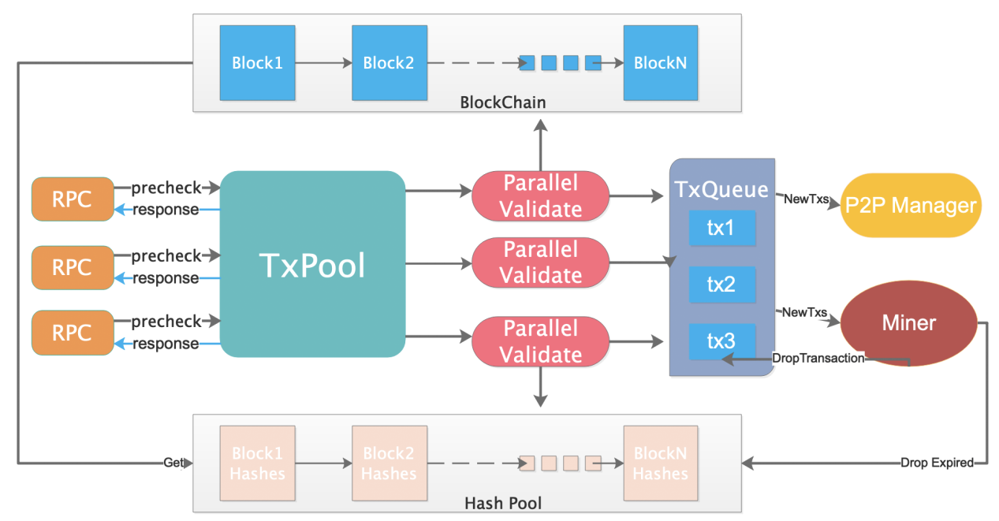

##### 交易打包
为了提高交易处理效率，同时也为了确定交易之后的执行顺序保证事务性，当交易池中有交易时，Sealer线程负责从交易池中按照先进先出的顺序取出一定数量的交易，组装成待共识区块，随后待共识区块会被发往各个节点进行处理。

##### 交易执行
节点在收到区块后，会调用区块验证器把交易从区块中逐一拿出来执行。执行引擎就会把交易交给EVM（以太坊虚拟机）执行。

交易可能会执行成功，也可能因为逻辑错误或Gas不足等原因执行失败。交易执行的结果和状态会封装在交易回执中返回。

通过交易预执行生成的交易DAG，区块验证器可以并行调度DAG中的交易执行，提升交易执行的效率。

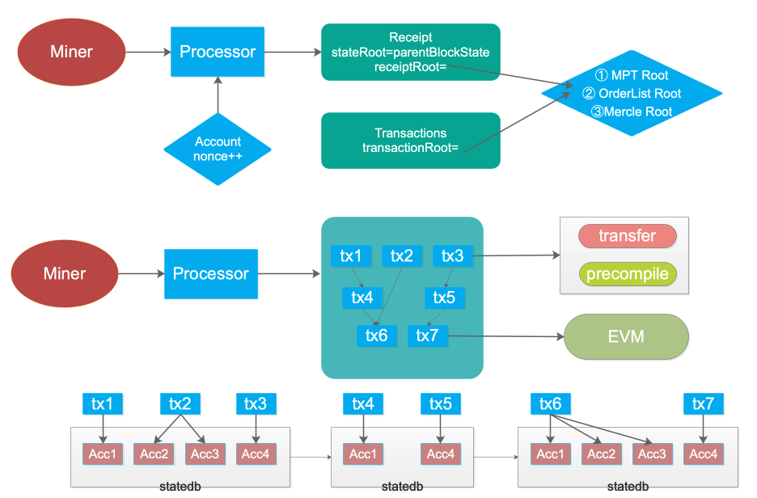

##### 交易共识
区块链要求节点间就区块的执行结果达成一致才能出块。一般采用PBFT共识保证整个系统的一致性。具体共识描述见共识机制模块。

##### 交易落盘
在共识出块后，节点需要将区块中的交易及执行结果写入硬盘永久保存，并更新区块高度与区块哈希的映射表等内容，然后节点会从交易池中剔除已落盘的交易，以开始新一轮的出块流程。用户可以通过交易哈希等信息，在链上的历史数据中查询自己感兴趣的交易数据及回执信息。

### 2.5 共识机制模块
在公链上，常见的共识算法有POW、POS、DPOS，而联盟链中一般为POA、RAFT、PBFT共识等。

#### 2.5.1 PBFT共识
BFT（拜占庭将军问题）是分布式计算中的一个经典问题。问题描述为，几位拜占庭将军分别率领部队合力包围了一座城市。他们必须一致决定是否发起攻城。如果一些将军在没有其他将军参与的情况下决定发起攻城，那么他们的行动将以失败告终。将军们之间相互隔着一定的距离，必须依靠信息传递进行交流。首个提出的该问题解决方案称为“实用拜占庭容错”（PBFT）

##### 核心流程
PBFT共识主要包括Pre-prepare、Prepare和Commit三个阶段：

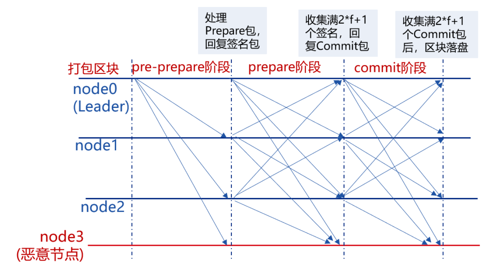

- Pre-prepare：负责执行区块，产生签名包，并将签名包广播给所有共识节点；
- Prepare：负责收集签名包，某节点收集满2*f+1的签名包后，表明自身达到可以提交区块的状态，开始广播Commit包；
- Commit：负责收集Commit包，某节点收集满2*f+1的Commit包后，直接将本地缓存的最新区块提交到数据库。

##### leader打包区块
PBFT共识算法中，共识节点轮流出块，每一轮共识仅有一个leader打包区块，节点计算当前leader索引与自己索引相同后，就开始打包区块。区块打包主要由PBFTSealer线程完成，Sealer线程的主要工作如下图所示：

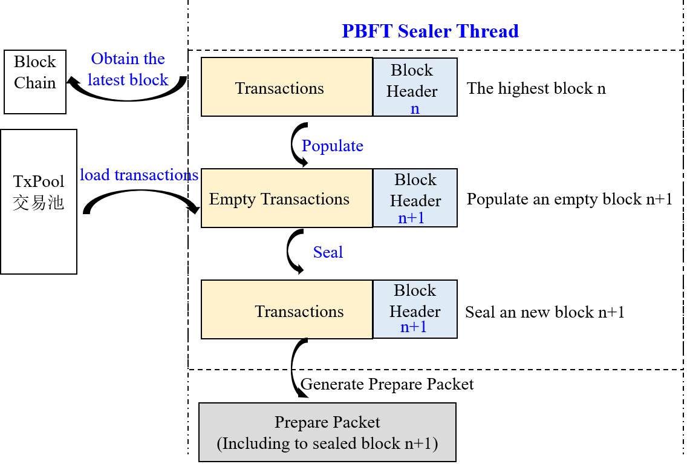

- **产生新的空块:**
通过区块链(BlockChain)获取当前最高块，并基于最高块产生新空块(将新区块父哈希置为最高块哈希，时间戳置为当前时间，交易清空)；
- **从交易池打包交易:**
产生新空块后，从交易池中获取交易，并将获取的交易插入到产生的新区块中；
- **组装新区块:**
Sealer线程打包到交易后，将新区块的打包者(Sealer字段)置为自己索引，并根据打包的交易计算出所有交易的transactionRoot；
- **产生Prepare包:**
将组装的新区块编码到Prepare包内，通过PBFTEngine线程广播给组内所有共识节点，其他共识节点收到Prepare包后，开始进行三阶段共识。

##### pre-prepare阶段
共识节点收到Prepare包后，进入pre-prepare阶段，此阶段的主要工作流程包括：

- **Prepare包合法性判断：**
主要判断是否是重复的Prepare包、Prepare请求中包含的区块父哈希是否是当前节点最高块哈希(防止分叉)、Prepare请求中包含区块的块高是否等于最高块高加一；
- **缓存合法的Prepare包:** 若Prepare请求合法，则将其缓存到本地，用于过滤重复的Prepare请求；
- **空块判断：**
若Prepare请求包含的区块中交易数目是0，则触发空块视图切换，将当前视图加一，并向所有其他节点广播视图切换请求；
- **执行区块并缓存区块执行结果:**
若Prepare请求包含的区块中交易数目大于0，则调用BlockVerifier区块执行器执行区块，并缓存执行后的区块；
- **产生并广播签名包：**
基于执行后的区块哈希，产生并广播签名包，表明本节点已经完成区块执行和验证。

##### Prepare阶段
共识节点收到签名包后，进入Prepare阶段，此阶段的主要工作流程包括：

- **签名包合法性判断：**
主要判断签名包的哈希与pre-prepare阶段缓存的执行后的区块哈希相同，若不相同，则继续判断该请求是否属于未来块签名请求(产生未来块的原因是本节点处理性能低于其他节点，还在进行上一轮共识，判断未来块的条件是：签名包的height字段大于本地最高块高加一)，若请求也非未来块，则是非法的签名请求，节点直接拒绝该签名请求；
- **缓存合法的签名包：**
节点会缓存合法的签名包；
- **判断pre-prepare阶段缓存的区块对应的签名包缓存是否达到2f+1，**
若收集满签名包，广播Commit包：若pre-prepare阶段缓存的区块哈希对应的签名包数目超过2*f+1，则说明大多数节点均执行了该区块，并且执行结果一致，说明本节点已经达到可以提交区块的状态，开始广播Commit包；
- **若收集满签名包，备份pre-prepare阶段缓存的Prepare包落盘：**
为了防止Commit阶段区块未提交到数据库之前超过2*f+1个节点宕机，这些节点启动后重新出块，导致区块链分叉(剩余的节点最新区块与这些节点最高区块不同)，还需要备份pre-prepare阶段缓存的Prepare包到数据库，节点重启后，优先处理备份的Prepare包。

##### Commit阶段
共识节点收到Commit包后，进入Commit阶段，此阶段工作流程包括：

- **Commit包合法性判断：**
主要判断Commit包的哈希与pre-prepare阶段缓存的执行后的区块哈希相同，若不相同，则继续判断该请求是否属于未来块Commit请求(产生未来块的原因是本节点处理性能低于其他节点，还在进行上一轮共识，判断未来块的条件是：Commit的height字段大于本地最高块高加一)，若请求也非未来块，则是非法的Commit请求，节点直接拒绝该请求；
- **缓存合法的Commit包：**
节点缓存合法的Commit包；
- **判断pre-prepare阶段缓存的区块对应的Commit包缓存是否达到2f+1，若收集满Commit包，则将新区块落盘：**
若pre-prepare阶段缓存的区块哈希对应的Commit请求数目超过2f+1，则说明大多数节点达到了可提交该区块状态，且执行结果一致，则调用BlockChain模块将pre-prepare阶段缓存的区块写入数据库；

#### 2.5.2 优化后的PBFT
##### 平行验证拜占庭容错共识算法（Parallel Byzantine Fault Tolerance）

在传统区块链共识算法(PoW、PoS、DPoS、IBFT、Raft等)中，区块被出块节点打包、验证执行后广播给同步节点，同步节点在获取到新区块后，再对区块进行执行与验证，那么如果该同步区块是下一轮共识的出块节点，区块打包与广播时间将被延迟在这个区块执行之后。在高性能区块链场景中，区块的执行与验证是非常耗时的，如图5所示，节点B在节点A出块后，需要执行验证节点A出的块与自身节点将要出的块，那么共识过程将被推迟至t = 2*t(验证) + t(广播)。
对于这种问题，以EOS为代表的区块链采用了连续出块的方式，既节点A连续打包并广播n个区块，如此一来，节点B只会在同步A最后一个区块n并产生自己第一个区块时，才会产生延迟出块的情况。
在Simplechain中，为了更好地解决这一问题，采用了平行验证拜占庭容错共识算法Parallel Byzantine Fault Tolerance，这种算法充分汲取了PBFT共识算法的优势，在执行验证区块时采用了三阶段区块哈希策略，在保证安全性的同时，可以使得所有共识节点在达成共识的同时完成区块的执行与验证，大大缩短了共识达成的时间与出块的间隙时间

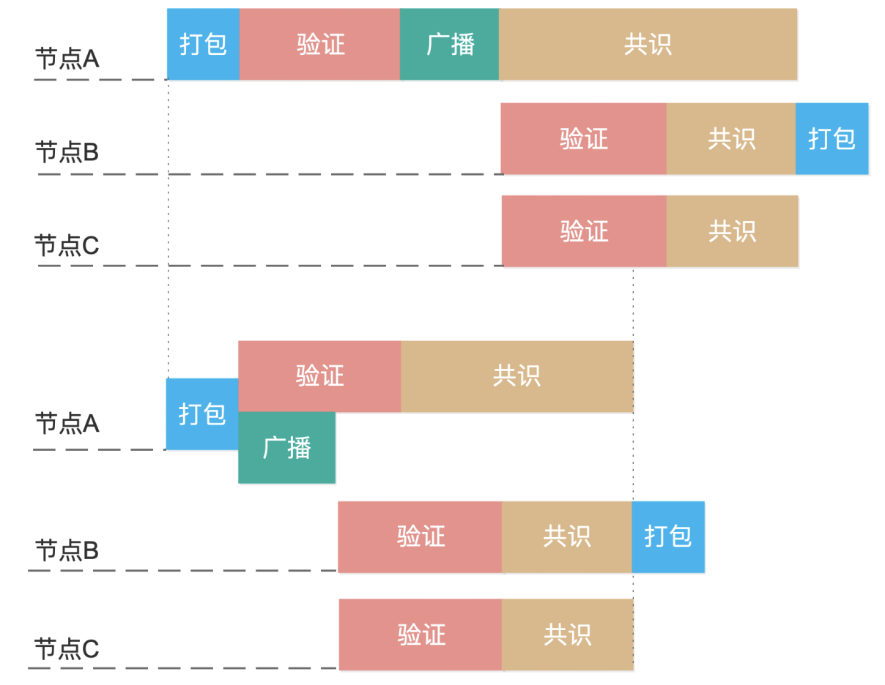

平行验证拜占庭容错共识算法主要流程分为以下几个步骤
①　Leader节点首先对区块头parentHash、number、difficulty、timestamp、mixDigest、nonce、txRootHash字段计算sealHash，并对此sealHash签名生成leader-signature
②　Leader节点将leader-signature填充进区块头，对新区块头进行哈希运算可以得到pendingHash，正式开始共识的pending-proposal阶段
③　Leader节点将pending-proposal封装成pre-prepare消息，向其他共识节点广播，同时，在自己的状态机环境下预执行此pending区块
④　Replica节点在收到Leader节点的pending-proposal后，会在自己的状态机环境下预执行pending区块
⑤　Leader节点与Replica节点对预执行的区块结果验证后通过执行后的区块头生成conclusionHash，开始conclusion阶段的共识，对pendingHash、conclusionHash及共识视图状态签名后广播prepare消息
⑥　共识节点在收到满足拜占庭容错数量的prepare消息后，广播commit消息
⑦　共识节点在收到满足拜占庭容错数量的commit消息后，在预执行区块的区块头中加入节点签名消息，将共识成功的区块写入自己的区块链中，并提交状态机状态变更。

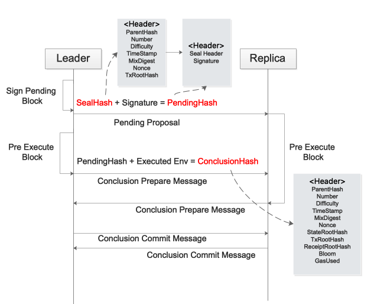

##### 轻区块优化

共识算法使用轻区块Light Block技术，在共识过程中大大降低了网络通信的开销，优化方式如下：
步骤②中，Leader节点签名生成pending-proposal后，不对其他共识节点广播区块中的交易，仅广播pending区块头以及区块包含的所有交易的哈希，即light-pending-proposal
步骤④中，Replica节点在收到light-pending-proposal后，首先会从交易池中获取命中的交易填充区块，之后向Leader节点请求缺失的交易数据，填充生成完整的pending-proposal

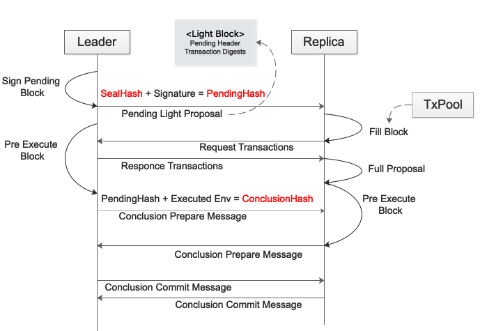

### 2.6 智能合约模块
#### 2.6.1 智能合约的概念
智能合约（smart contract）这个术语至少可以追溯到 1995 年，是由多产的跨领域法 律学者尼克·萨博（Nick Szabo）提出来的。他的定义是“一个智能合约是一套以数字形式定义的承诺（promises），包括合约参与方可以在上面执行这些承诺的协议。”

- **承诺：**
一套承诺指的是合约参与方同意的（经常是相互的）权利和义务。这些承诺定义了合约 的本质和目的。以一个销售合约为典型例子。卖家承诺发送货物，买家承诺支付合理的货款。
- **数字形式：**
数字形式意味着合约不得不写入计算机可读的代码中。这是必须的，因为只要参与方达成协定，智能合约建立的权利和义务，是由一台计算机或者计算机网络执行的。
- **达成协定：**
智能合约的参与方什么时候达成协定呢？答案取决于特定的智能合约实施。一般而言，当参与方通过在合约宿主平台上安装合约，致力于合约的执行时，合约就被发现了。
- **合约执行：**
“执行”的真正意思也依赖于实施。一般而言，执行意味着通过技术手段积极实施。
- **计算机可读的代码：**
另外，合约需要的特定“数字形式”非常依赖于参与方同意使用的协议。
- **协议：**
协议是技术实现（technical implementation），在这个基础上，合约承诺被实现， 或者合约承诺实现被记录下来。选择哪个协议取决于许多因素，最重要的因素是在合约履行期间，被交易资产的本质。

智能合约，就是一段写在区块链上的代码，一旦某个事件触发合约中的条款，代码即自动执行。也就是说，满足条件就执行，管他愿不愿意。

#### 2.6.2 智能合约的工作原理
智能合约是一段写在区块链上的代码，智能合约的工作原理如下：
构建 → 存储 → 执行
- 1）智能合约由区块链内的多个用户共同参与制定，可用于用户之间的任何交易行为。协议中明确了双方的权利和义务，开发人员将这些权利和义务以电子化的方式进行编程，代码中包含会触发合约自动执行的条件。比方说，你把一套闲置的房子租给A，那么，这份智能租约中就规定了A必须在每月5号之前给你打房租、你必须在收到房租时马上给对方钥匙等条款。
- 2）一旦编码完成，这份智能合约就被上传到区块链网络上，即全网验证节点都会接收到你和A的租房合约。
- 3）智能合约会定期检查是否存在相关事件和触发条件；满足条件的事件将会推送到待验证的队列中。假设A在4号提前打房租给你，这个事件就成了该合约的触发条件（每月5号以前）。
- 4）区块链上的验证节点先对该事件进行签名验证［3］，以确保其有效性；等大多数验证节点对该事件达成共识后，智能合约将成功执行，并通知用户。
- 5）成功执行的合约将移出区块。而未执行的合约则继续等待下一轮处理，直至成功执行。

#### 2.6.3 虚拟机EVM
EVM是一个轻量级的虚拟机，其设计是用于在simplechain网络上运行智能合约。虚拟机(VM）是建立在本机操作系统上模拟物理机的高级抽象。同时它也是一个“堆栈机”和一个“状态机”，它是一台可以读取输入并基于这些输入转换为新状态的机器，也是将内存结构组织为堆栈并作为堆栈访问的虚拟机。EVM不仅是沙盒封装的，而且是完全隔离的，作为区块验证协议共识算法的一部分，参与网络的每个节点都会运行EVM。

#### 2.6.4 智能合约

- **Solidity：**
智能合约默认的编程语言，文件扩展名以.sol结尾。Solidity是一种语法类似JavaScript的高级语言。它被设计成以编译的方式生成虚拟机代码。
- **合约事件：**
simplechain联盟链中的事件是一个simplechain联盟链日志和事件监测协议的抽象，日志记录提供合约的地址，事件则利用现有的ABI功能来解析日志记录。对合约事件的监听，可以在业务上实现部分自动化的操作。
- **权限管理：**
通过合约接口实现，simplechain联盟链网络的加入和退出，需要通过管理节点的申请、投票，符合半数以上节点通过原则，方可加入或退出网络。
- **角色管理：**
通过合约接口实现，普通节点升级为管理员节点或管理员节点降级为普通节点都需要通过管理员节点的审核，符合半数以上节点通过原则，方可完成角色的转变。降级为普通角色的节点将失去对网络的部分管理权限。
- **合约生命周期管理：**
实现合约的升级、冻结等功能。

### 2.7 账户模块
#### 2.7.1 账户的作用
账户在simplechain联盟链里发挥着中心作用。所有账户的状态代表simplechain联盟链网络的状态，simplechain联盟链坊网络会和每一个区块一起更新，网络需要达成关于simplechain联盟链的共识。账户和账户对应的签发证书代表外部代理人的身份，账户运用非对称加密的私钥文件来签署交易的同时并验证账户对应的签发证书的合法性，以便EVM虚拟机可以安全验证交易发送者的身份。

#### 2.7.2 合约账户
合约账户简称为合约，由智能合约的代码控制。只有合约账户才有代码，其中存储的是codeHash（这个账户的EVM虚拟机代码的哈希值）。这个字段在生成后是不可修改的，这意味着智能合约代码是不可修改的。

合约账户不能主动发起交易，只能在被触发后按预先编写的智能合约代码执行。合约账户有账户余额、有代码、能被出发执行智能合约代码、在智能合约创建后自动运行。

#### 2.7.3 外部账户
外部账户代表着外部代理人（例如人物角色，节点，或是自动代理人）的身份。

每个外部账户都由一对密钥来定义，包括私钥文件、证书文件以及CA根证书。账户以地址为索引，地址由证书文件里的公钥生成，每对私钥/地址都编码在一个私钥文件（JSON文件）中，其中最重要的为账户私钥，通常用创建账户时的密码加密。使用外部账户发起交易之前需要校验签发证书的合法性以及账户解锁。

外部账户可以触发交易。外部账户有账户余额、无代码、能触发交易（转账或执行智能合约）、由私钥文件、证书文件以及根证书文件控制。